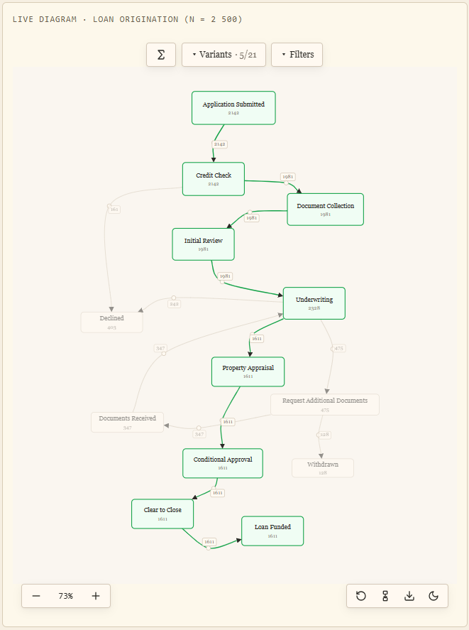
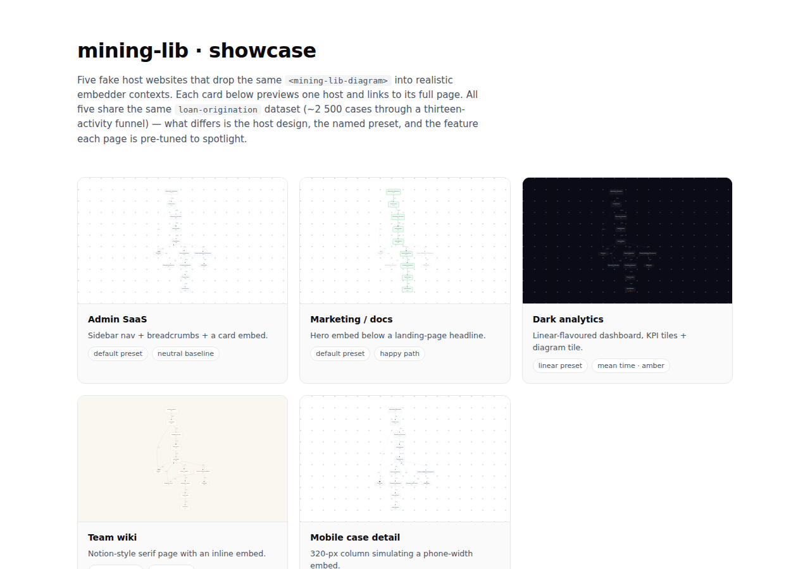

# mining-lib

Embed an interactive process map in any web page — straight from an event log. No backend, no framework lock-in.


mining-lib turns a CSV or NDJSON event log into an interactive **Directly-Follows Graph**. It runs entirely in the browser, ships as a framework-agnostic web component, and weighs ~70 kB gzipped (D3 + dagre under the hood).

- **Input** — CSV or NDJSON, auto-detected. The shape is one row per event: a case id, an activity, a timestamp, and optional resource + custom attributes (full contract in [`LOG_FORMAT_SPEC`](data/input/LOG_FORMAT_SPEC.md)). Sample logs ship in [`data/input/runs/`](data/input/runs).
- **Output** — an interactive `<mining-lib-diagram>`: pan, zoom, drag nodes and edges, filter by variant / attribute / date / resource / single case, drill into any case's trace, switch count and timing modes, flip light/dark, and export to SVG or PNG.
- **Need a log?** The companion generator **[ProcessLog](https://github.com/crlsrmrlsz/processlog)** synthesises realistic event logs in exactly this format — handy for demos, tests, and trying the library without real data.




**[▶ Live demo](https://crlsrmrlsz.github.io/mining-lib/)**  ·  **[Usage reference](docs/USAGE.md)**  ·  **[npm](https://www.npmjs.com/package/mining-lib)**


## Demo

Five embeds of the same ~2,500-case loan-origination log, each tuned to spotlight a different feature — a SaaS dashboard, a marketing page, a dark analytics view, a paper-style wiki, and a mobile case detail.

[](https://crlsrmrlsz.github.io/mining-lib/)

**▶ [Open the live demo →](https://crlsrmrlsz.github.io/mining-lib/)**

## How it works

Drop it into a page in three steps: install, load a log, render.

```ts
import { parseLog, buildDfg, createDiagram } from "mining-lib";

// 1 — your log, fetched however you like (string of CSV or NDJSON)
const text = await fetch("/my-event-log.csv").then((r) => r.text());

// 2 — parse it (format auto-detected; malformed rows are reported, not silently dropped)
const { log, warnings } = parseLog(text);

// 3 — build the graph and render it into any element
const diagram = createDiagram("#chart", { countMode: "absolute" });
diagram.render(buildDfg(log));
```

Prefer markup? The same thing as a custom element — works in plain HTML or any framework template:

```html
<script type="module" src="https://cdn.jsdelivr.net/npm/mining-lib"></script>

<mining-lib-diagram preset="linear" rankdir="TB" count-mode="case"></mining-lib-diagram>
```

```sh
npm install mining-lib
```

The full API — count/time modes, filters, theming, pan/zoom control, per-case drill-down, exports, and the web-component attributes — lives in **[docs/USAGE.md](docs/USAGE.md)**.

## Develop

```sh
pnpm install
pnpm dev          # http://localhost:5173 — example + showcase pages, hot-reloaded
pnpm test         # unit (Vitest) + browser e2e (Playwright)
pnpm build        # ESM + UMD bundles + types into dist/
```

## License

MIT — see [LICENSE](LICENSE).
